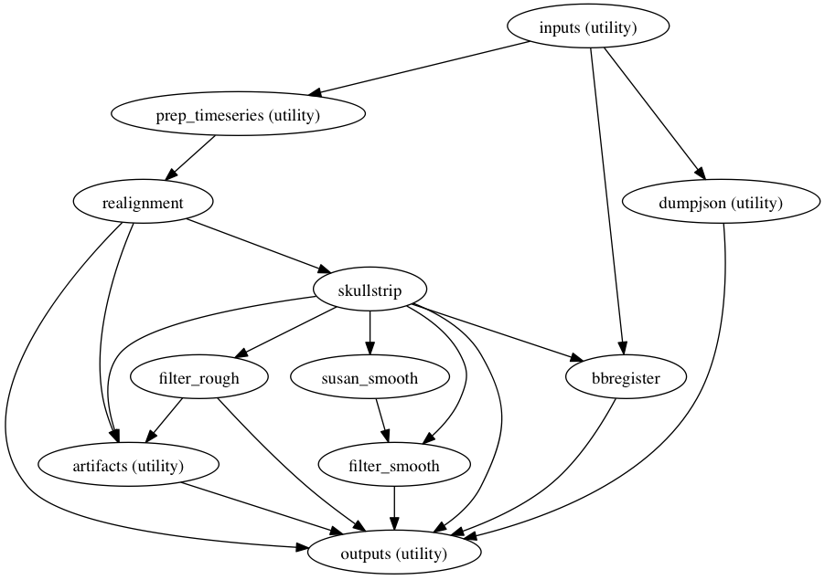
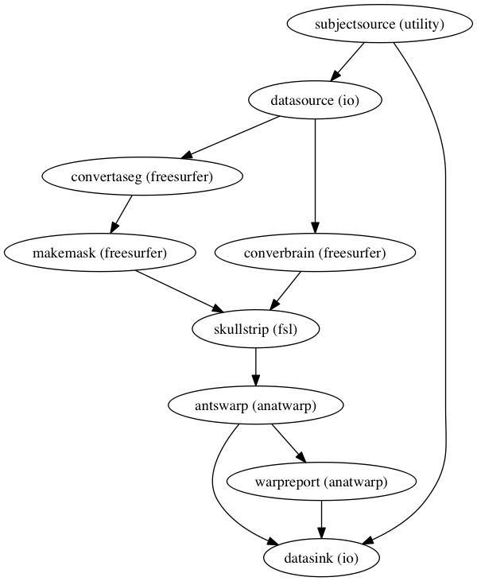
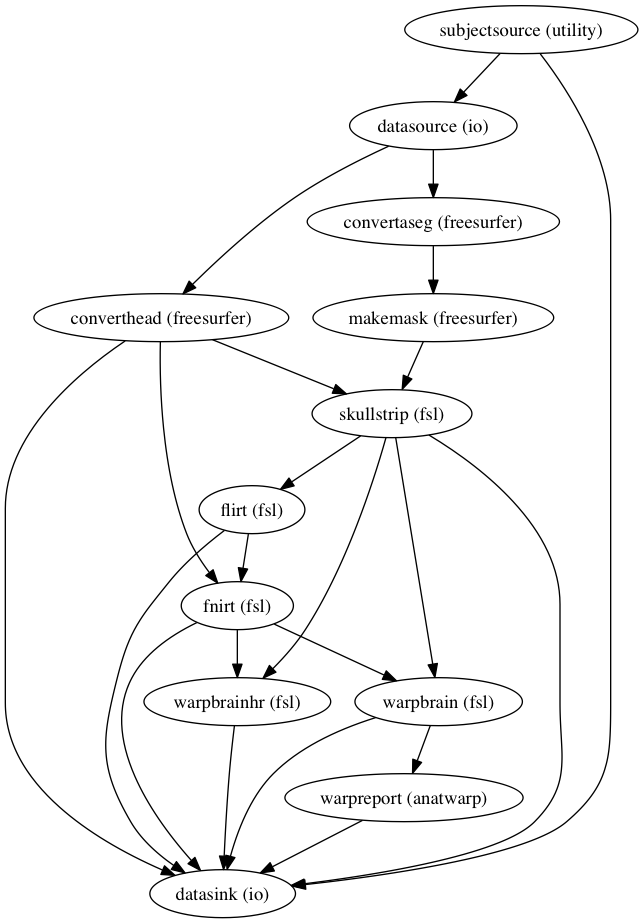
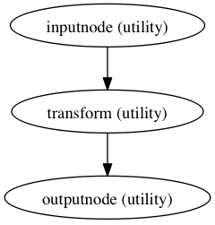
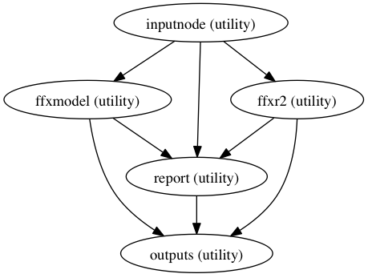
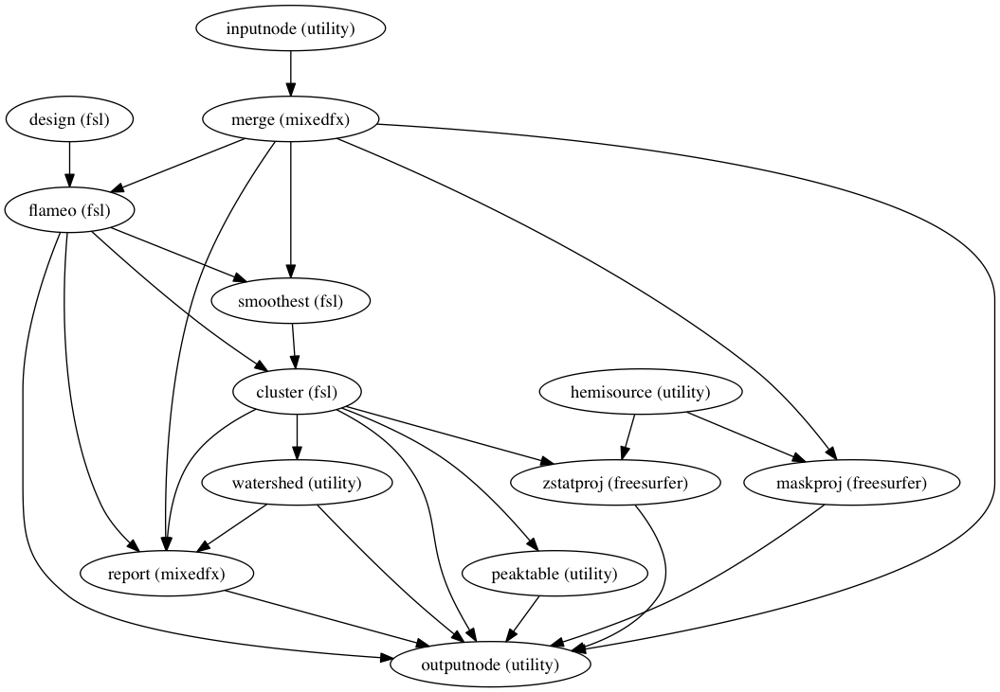
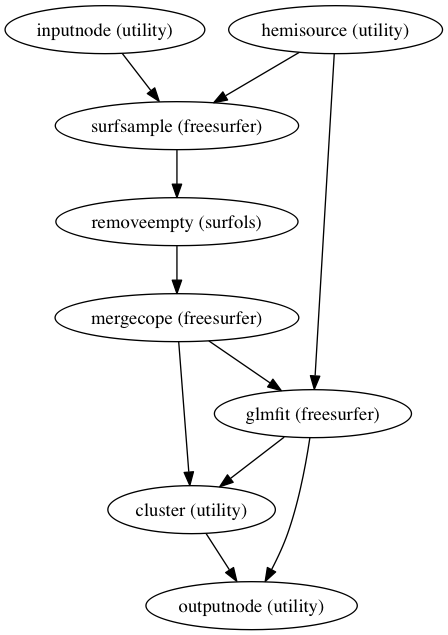

Nipype Processing Workflows
===========================

Functional Preprocessing
------------------------

Timeseries Model
----------------

Anatomical Normalization
------------------------

Using ANTS
~~~~~~~~~~

Using FSL
~~~~~~~~~

Coregistration
--------------

Fixed Effects Model
-------------------

Mixed Effects Model
-------------------

Surface OLS Model
-----------------

